

<h1> ᴛʜᴇᴘʀᴏᴛᴏᴋᴏᴛ</h1>

Многопользовательский Telegram-бот для игры **Amazing Online**, который предоставляет автоматизацию, инструменты, мониторинг и набор вспомогательных функций упрощающих повседневные игровые задачи.

---

## Содержание
- [Планы и улучшения](#планы-и-улучшения)
- [Обзор и скриншоты](#обзор-демонстрация-и-скриншоты)
- [Требования](#требования)
- [Возможности и функции](#возможности-и-функции)
- [Команды](#команды)
- [Библиотеки](#библиотеки)
- [Структура проекта](#структура-проекта)
- [Структура базы данных](#структура-базы-данных)
- [История версий и изменений](#история-версий-и-изменений)
- [Неполадки и идеи](#неполадки-и-идеи)
- [Лицензия](#лицензия)

## Планы и улучшения

> [!NOTE]
> Список актуален на момент последнего обновления README. Идеи и предложения приветствуются через [Feature Request](https://github.com/NZK95/TheProtoKot/issues/new?template=feature_request.md).

### В разработке

### Запланировано
- [ ] Переход на PostgreSQL
- [ ] Улучшить интерфейс, расположение кнопок, удаление сообщений
- [ ] Уведомления об изменении статуса жалобы
- [ ] Возможность получать сообщение о жалобе разными способами (несколько уведомлений)
- [ ] Новые подсказки и AHK
- [ ] Найти способ генерировать изображение документа без водяного знака

### Выполнено
- [x] Чекер жалоб с автоуведомлениями

## Обзор, демонстрация и скриншоты

---

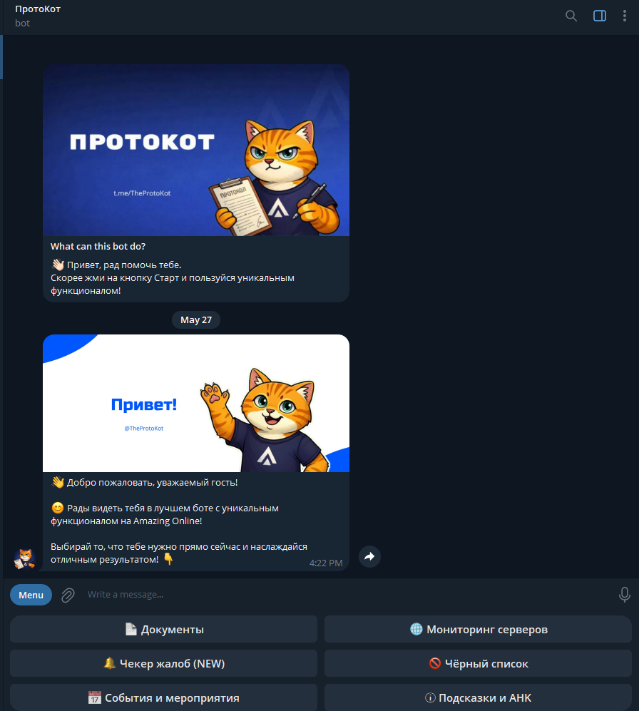 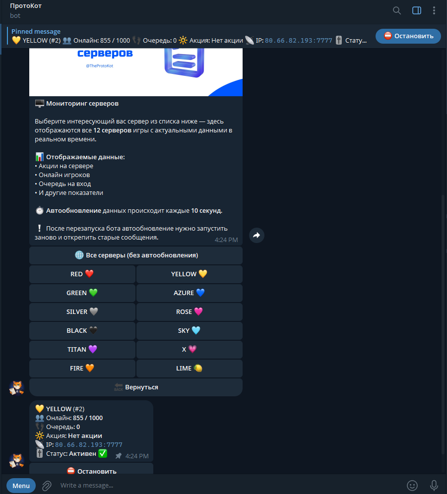 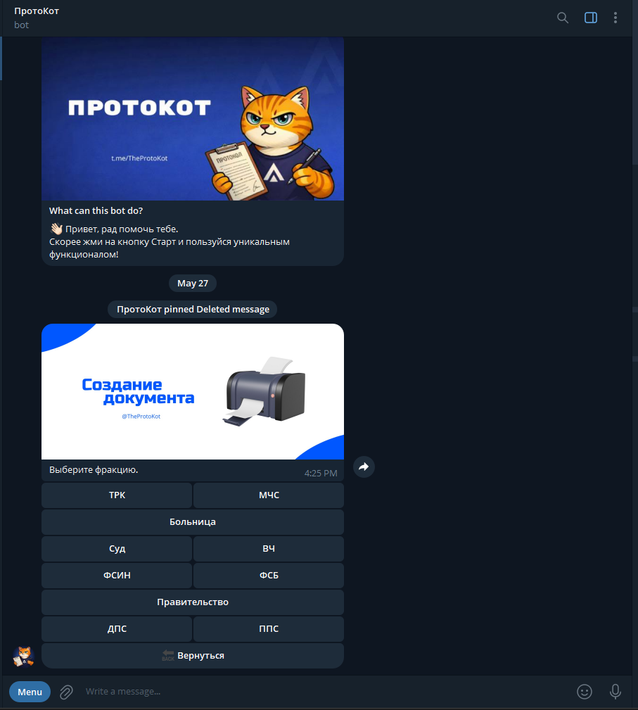

---

 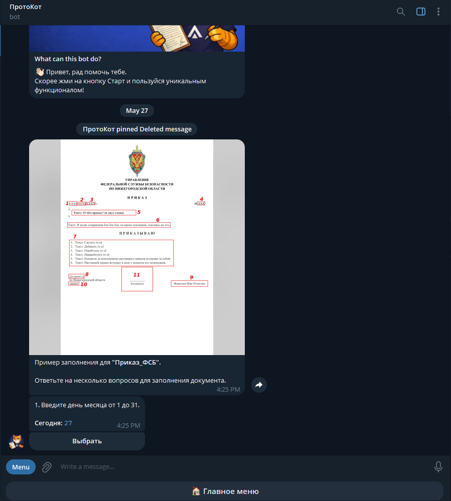 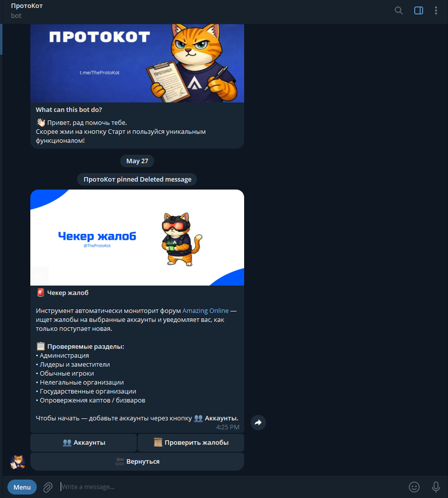 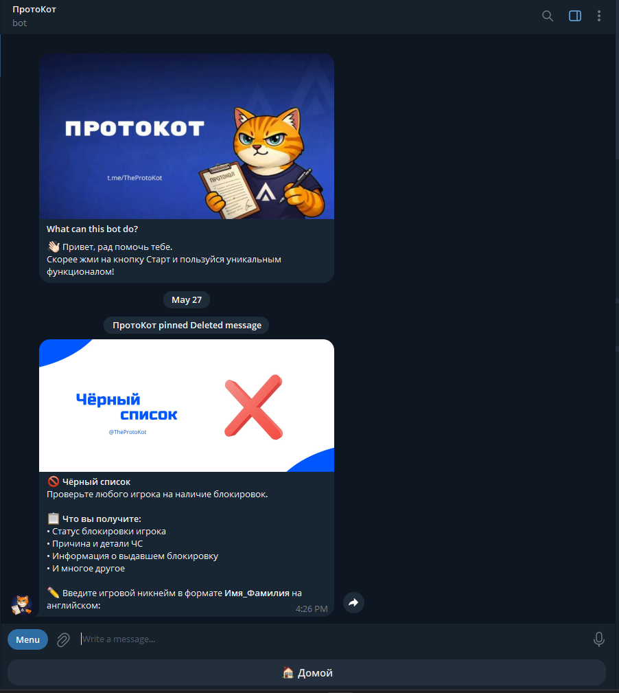  

---

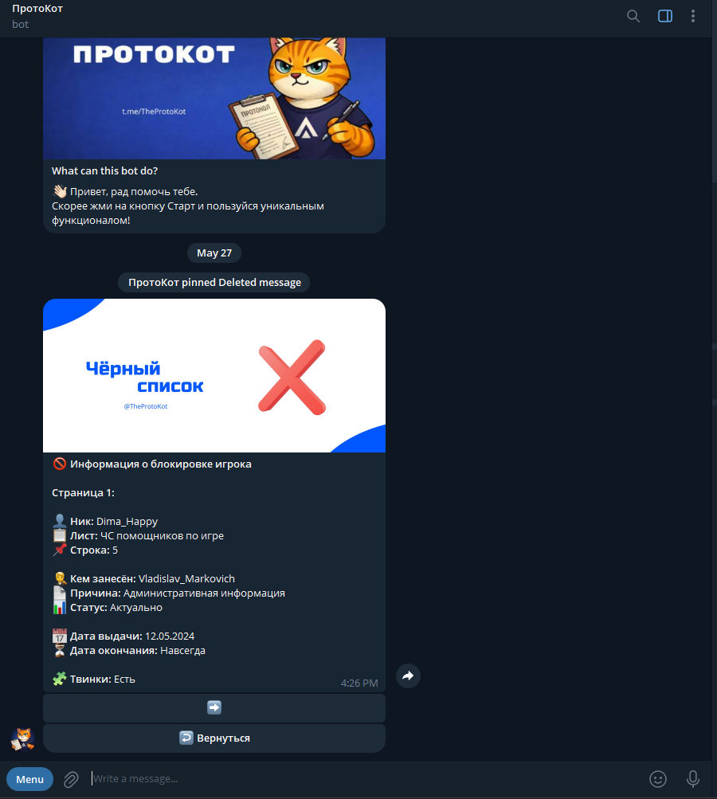 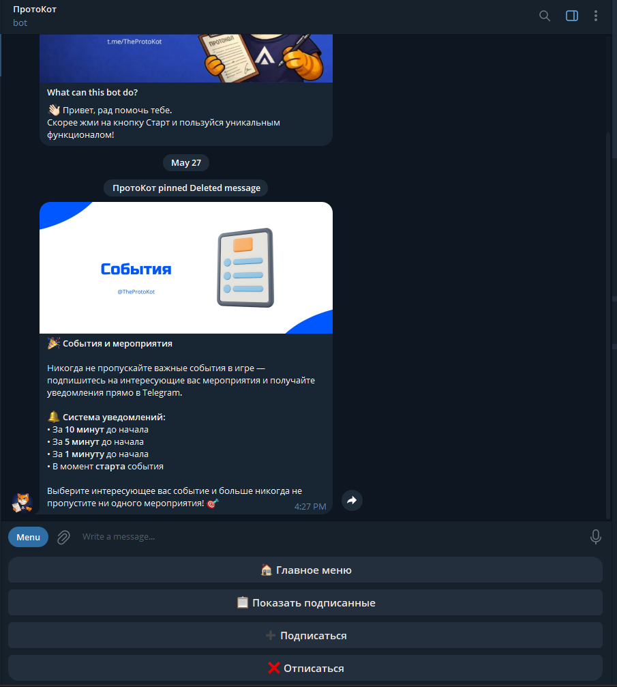 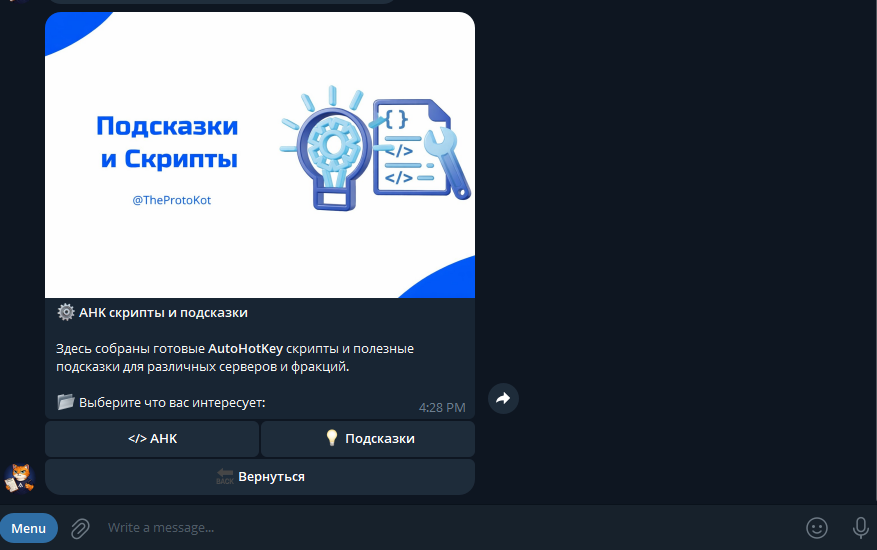

---

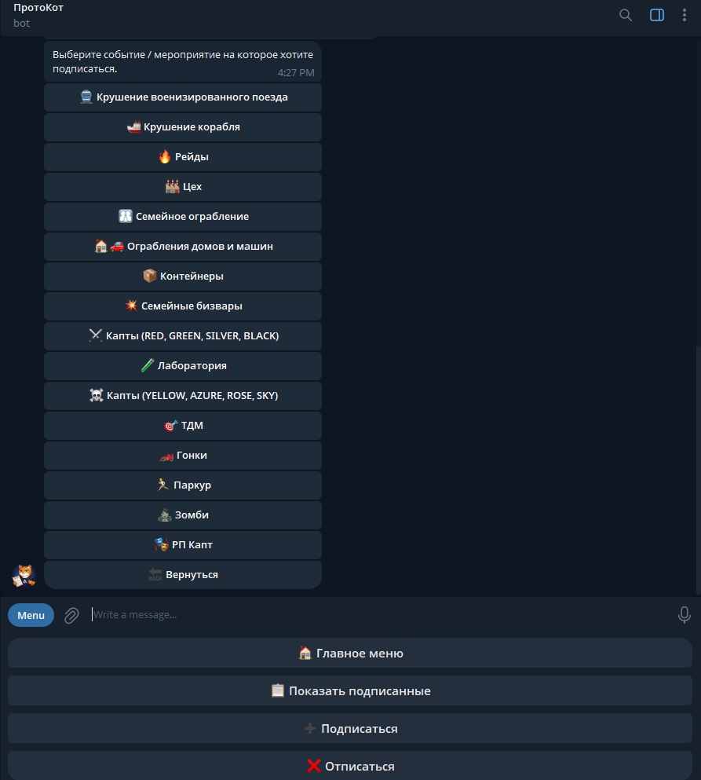 

---

## Требования
- [.NET 8.0+](https://dotnet.microsoft.com/en-us/download/dotnet/8.0)
- Windows 10/11 *(Linux не поддерживает нужные библиотеки)*
- Установленный [Playwright](https://playwright.dev/dotnet/docs/intro) с браузером **Firefox**
- Telegram-бот, созданный через [@BotFather](https://t.me/BotFather)

## Возможности и функции
- **📄 Документы** - Система автоматического создания документов и протоколов для различных фракций. Пользователю достаточно выбрать нужную фракцию, тип документа и ответить на несколько вопросов — бот самостоятельно сформирует готовый результат в нужном формате (документ, изображение или ссылка на фотохостинг).

- **🖥️ Мониторинг серверов** - Система слежения за состоянием серверов **Amazing Online** в реальном времени. Пользователь выбирает сервер для отслеживания — бот автоматически обновляет информацию (раз в 10 секунд) и уведомляет об изменениях (сообщение можно закрепить). Доступные данные: онлайн игроков, очередь на вход, текущие акции, IP-адрес сервера и многое другое.

- **✍️ Подписи** - Инструмент для создания подписей со штампами фракций. Пользователь загружает изображение своей подписи, выбирает нужный штамп — после чего бот автоматически объединяет изображение, переворачивает штамп влево или вправо (выбирается случайно) на 30 градусов и отправляет готовый результат в формате PNG.
> [!WARNING]
> Важн, что бы подпись пользователя имела прозрачный фон, потому что она накладывается сверху штампа.

- **🚫 Чёрный список** - Система проверки игроков по базам чёрных списков различных серверов. Пользователь вводит никнейм и сервер, после чего бот выполняет поиск и отображает подробную информацию о блокировке.

- **🔔 События и мероприятия** - Система уведомлений о серверных событиях и мероприятиях. Пользователи могут подписываться на интересующие события и получать уведомления перед их началом и в момент старта.

- **⚠️ Чекер жалоб** - Инструмент для отслеживания жалоб на форуме Amazing Online. Пользователь привязывает аккаунт, указывая игровой ник и маску, после чего бот автоматически уведомляет о новых жалобах и предоставляет подробную информацию.

- **💡 Подсказки и AHK** - Раздел с полезными подсказками и AHK-скриптами для различных серверов и фракций.

> [!NOTE]
> Пользователь должен подписаться на телеграм канал для использования бота.

## Команды
| Команда | Описание |
|---|---|
| `/start` | Запуск и главное меню. |
| `/report` | Предложить идею или сообщить об проблеме в официальном телеграм канале **ПротоКота**. |
| `/coder` | Показать информацию о кодере и автора бота. |

## Библиотеки
| Библиотека | Версия | Назначение |
|---|---|---|
| [Telegram.Bot](https://github.com/TelegramBots/Telegram.Bot) | 22.8.1 | Работа с Telegram Bot API |
| [Microsoft.Playwright](https://playwright.dev/dotnet) | 1.58.0 | Парсинг форума (чекер жалоб) |
| [SixLabors.ImageSharp](https://github.com/SixLabors/ImageSharp) | 3.1.12 | Генерация и обработка изображений |
| [DocX](https://github.com/xceedsoftware/DocX) | 5.0.0 | Создание и редактирование DOCX |
| [Spire.Doc](https://www.e-iceblue.com/Introduce/spire-doc-for-net.html) | 14.1.12 | Конвертация DOCX в изображения |
| [EPPlus](https://github.com/EPPlusSoftware/EPPlus) | 8.4.2 | Чтение Excel-таблиц (чёрные списки) |
| [Microsoft.Data.Sqlite.Core](https://learn.microsoft.com/en-us/dotnet/standard/data/sqlite) | 10.0.2 | Работа с SQLite базами данных |
| [Microsoft.Extensions.Hosting](https://learn.microsoft.com/en-us/dotnet/core/extensions/hosting) | 10.0.2 | DI-контейнер и фоновый хост-сервис |

## Структура проекта

Нажмите сюда, чтобы посмотреть.

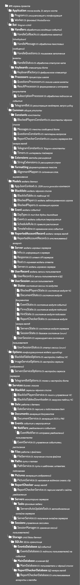

## Структура базы данных
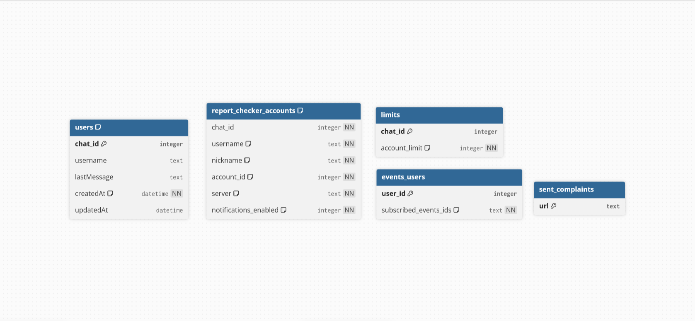

## История версий и изменений 
Полный список изменений между версиями доступен в [CHANGELOG.md](CHANGELOG.md).

## Неполадки и идеи
**Прочие ошибки**  
Открой [Issue](https://github.com/NZK95/TheProtoKot/issues/new?template=bug_report.md) с описанием проблемы и текстом ошибки из консоли — постараюсь помочь.
 
**Есть идея или предложение?**  
Буду рад новым идеям — открывай [Feature Request](https://github.com/NZK95/TheProtoKot/issues/new?template=feature_request.md) и описывай что хочется видеть в боте.
 
## Лицензия
Проект распространяется под лицензией [MIT](LICENSE).

---

